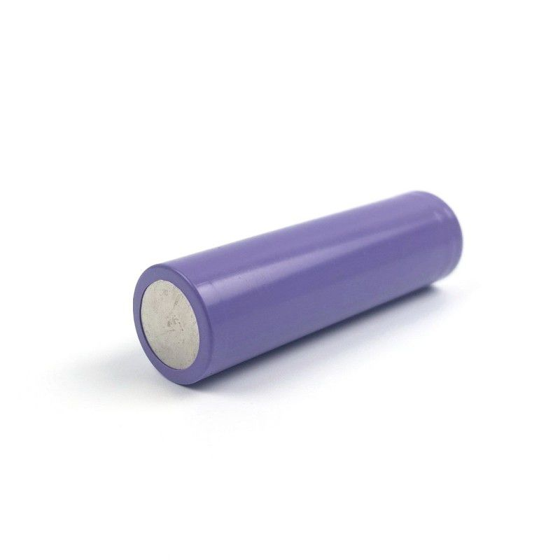
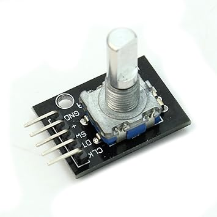
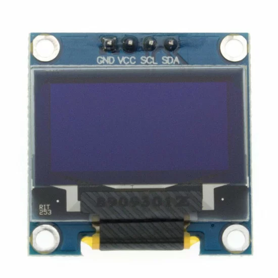
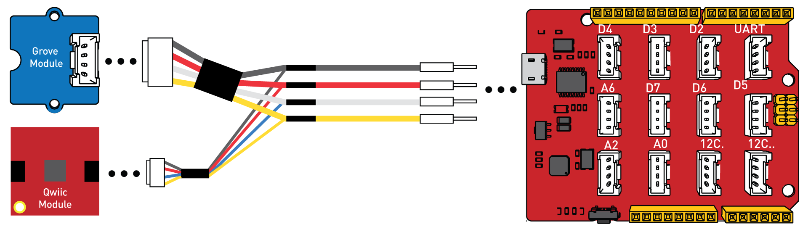

# Pintegrume: Concept

This document encapsulate the conceptualization of the project _Pintegrume_.
Pintegrume is made out of 3 terms, pi, integral, and rume.
Pi stands for Raspberry Pi Pico. Integral stands for integrated battery management, peripheral input and output. Rume stands for the author, RumeLab.

Usually, in the case of simple edge devices, it is usually a composition of one or more different affectors and effectors.
For these kind of devices, battery management, peripheral input and output are common and cruicial,
for enabling functioning without plug and interacting with the system.
However, in some cases, the battery management, peripheral input and output consume more development effort compare to the main mechanism,
especially when it is about interfacing with very few electronic components.

Thus, it would be ideal to have a simple embedded system framework that includes a battery management and peripheral input and output.
To reduce complexity, the solution should expose minimal pins.
There are 4 pins that are exported:

- `Vcc` pin
- `GND` pin
- `SDA` pin
- `SCL` pin

The `Vcc` and `GND` pins are essential for powering up the subcircuitory, while the other 2 is mainly for serial communication.
The targeted serial communication is the I2C communication protocol.
It would be ideal for the 2 serial communication pins supports multiple functionality such as UART protocol and GPIO.
The general purpose serial communication pins are feasible with microcontrollers such as Raspberry Pi Pico, which is the targeted microcontroller.
Figure 1 shows the pinout for Raspberry Pi Pico.

 \
_Figure 1: Raspberry Pi Pico Pinout_

## Battery management system.

The battery management is simple.
The targeted battery is 18650 battery.
The rationale of choosing this kind of battery is because of the ease of mount and dismounting and rechargable externally.
This capability of able to dismount and recharge at ease externally brings simplicity to the main circuit since it is not required to integrate a custom charging subcircuitory.
Figure 2 below illustrate the 18650 battery.

 \
_Figure 2: 18650 lithium ion Battery_

## Peripheral input and output

For peripheral input, the ideal case is to have minimal input device for option selections.
With option selection capability, one could alter the state of the system by selecting the corresponding option.
It would be sufficient for simple edge devices.
An ideal candidate is the KY-040 rotary encoder knob module as illustrate in Figure 3.
This is due to the compactness of the module as it includes 2 independent input parameter, the rotary motion, and button push, into one module.

 \
_Figure 3: KY040 module_

For peripheral output, SDD1306 OLED display is a good candidate.
It has decent resolution with decent price tag.
Figure 4 illustrates the SDD1306 OLED display with 128x64 resolution.

 \
_Figure 4: SSD1306 OLED Display with 128x64 resolution_

## Fabrication

Since this is the first iteration of this project, a modular prototypical connection system would be much prefered instead of PCBs.
Instead of having all the electronic components into one board, we have each cruicial components in a form of its common breakout board.
To integrate all the board together, prototypical integrator circuit board is introduced.
It could be thought as a midpoint between breadboard and printed circuit board.
It is a manually-fabricated circuit on a donut board with the cruicial components connected via connectors, such as JST XH connector series.
It ensures the security in connection, which is especially cruicial for mobile devices, while having the modularity in which having the freedom to change the crucial components.
It is heavily inspired by Grove Ecosystem by Seeed Studio as shown in Figure 5.

 \
_Figure 5: Grove System by Seeed Studio_

For enclosure, 3D print technology is utilized for quick fabrication.
